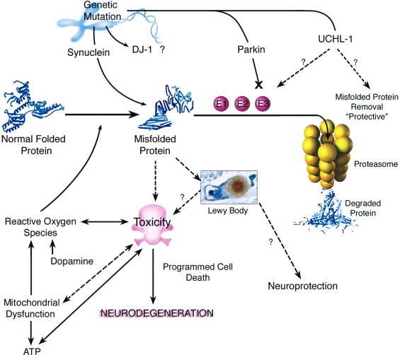
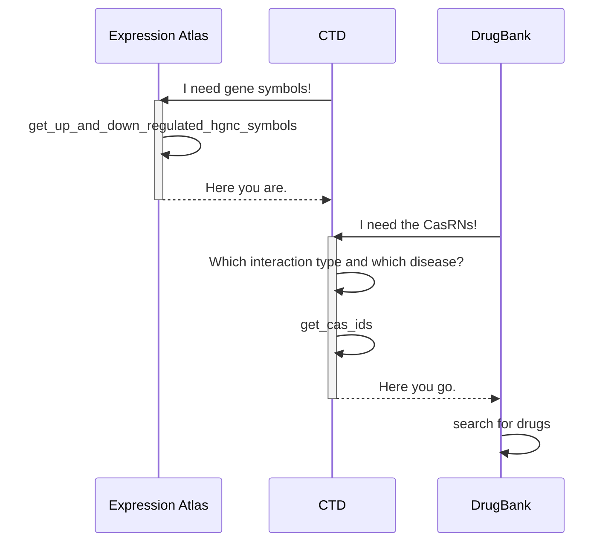
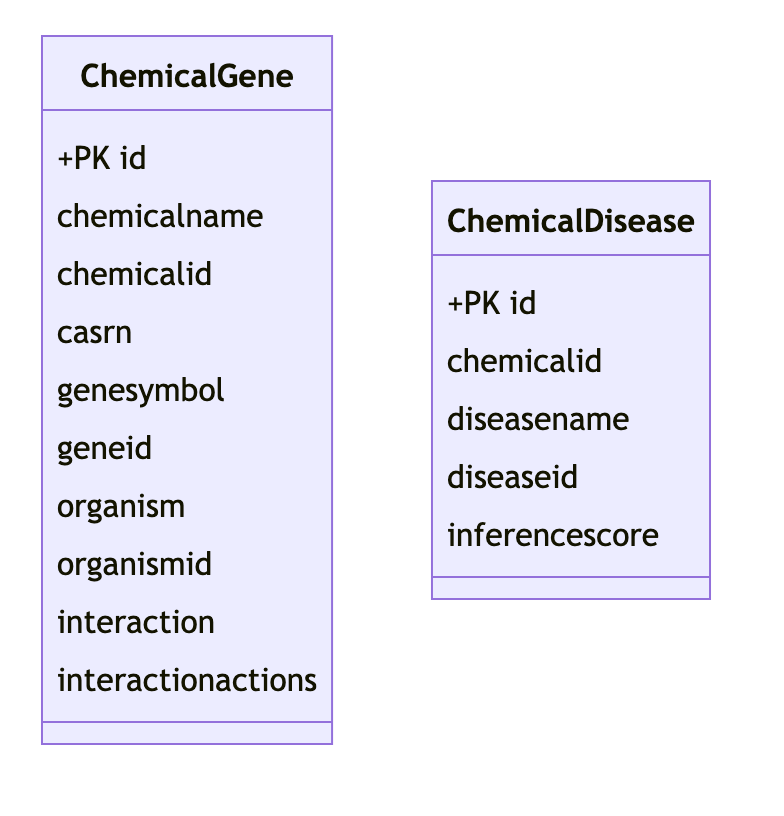
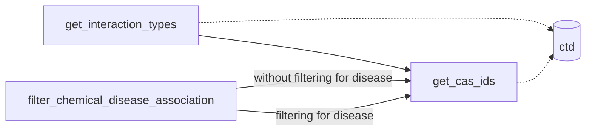
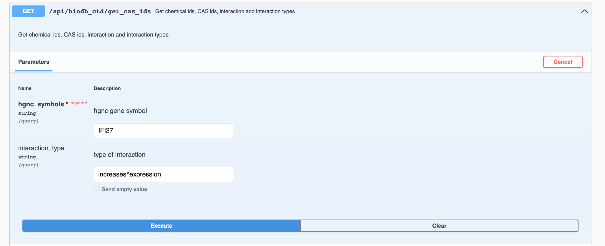
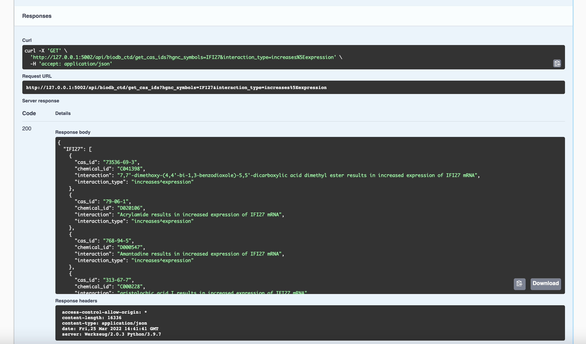

# Biological Databases Lab 2022
----- 

# Group 2 Project 
## Team members

+ Lara Schmalenstroer
+ Rohitha Ravinder

## Introduction

### Background Information

#### General Information

Parkinson's disease is a neurodegenerative disorder that affects approximately 10 million people worldwide. Most patients that are diagnosed with Parkinson's disease are older than 50 years (~96 %). The likelihood of developing PD can be influenced by having certain genetic mutations in at least one of the parents. Depending on the particularly affected gene (see more in section Disease mechanisms), the inheritance patterns differ.[^1]

The three main symptoms of Parkinson's disease, also referred to as parkinsonism, are tremor (shaking), bradykinesia (slowness of movement) and rigidity (muscle stiffness) which can lead to painful cramps. Next to the main symptoms of PD, there are other physical and cognitive and psychiatric symptoms that might occur, such as balance problems, dizziness or sweating and depression, anxiety or dementia.[^2]

[^1]: https://www.hopkinsmedicine.org/health/conditions-and-diseases/parkinsons-disease/the-genetic-link-to-parkinsons-disease
[^2]: https://www.nhs.uk/conditions/parkinsons-disease/symptoms/ 


#### Disease Mechanisms

In Parkinson's disease, there are many genes and pathways that are affected. Parkinson's Disease is a multifactorial disease, where both genetic and non-genetic, such as environmental factors, are involved. The most salient mechanisms involved in the development of Parkinson's Disease include:
+ Accumulation of misfolded proteins aggregates
  + Aggregation of alpha-synuclein (SNCA)
  + Hyper-phosphorylation of Tau
+ Genetic mutations
  + Parkin
  + DJ-1 (PARK7)
  + PINK1 (PARK6)
  + LRRK2/PARK8
  + PARK3, PARK9, PARK10, and PARK11
  + Glucocerebrosidase (GBA) gene mutation 
+ Failure of protein clearance pathways
  + Ubiquitin-Proteasome System (UPS)
  + Molecular chaperones
  + Autophagy lysosomal pathway (ALP)
+ Mitochondrial damage
  + Mutation of mitochondrial DNA (mtDNA)
+ Oxidative stress
+ Excitotoxicity
+ Neuroinflammation


The following figure[^3] summarizes the disease mechanisms.



[^3]: https://doi.org/10.1016/S0896-6273(03)00568-3 

#### Available Drugs

Until now, there is no cure for Parkinson's disease. 
But there are several drugs used to treat the symptoms of Parkinson's disease that can be ordered in six categories, all of which treat the symptoms targeting different proteins:[^4]
1. Levodopa

Levodopa is prescribed to PD patients because it is a precursor molecule of dopamine. While dopamine itself cannot cross the blood brain barrier, Levodopa can cross it and is then metabolized to dopamine by the DOPA decarboxylase. 
        
*Levodopa*, DrugBank Accession: _DB01235_. By synthesizing dopamine, the information flow in the brain is maintained so that movement can be executed in a control manner. Levodopa works as an agonist to the dopamine receptors D1 - D5. 
    
2. Dopamine agonists

Dopamine agonists stimulate the activity of the dopamine system by binding to the dopaminergic receptors. They do not have to be metabolized into dopamine. 

*Pramipexole*, DrugBank Accession: _DB00413_, is a non-ergot dopamine agonist drug, is used to treat tremor, rigidity, and bradykinesia (slow movement). It belongs to the class of small molecules and was first approved by the FDA in 1997. Although the mechanism is not fully understood yet it is thought that it stimulates dopamine receptors in the striatum of the brain. It is an agonist for the human D2, D3 and D4 dopamine receptor. 

3. Monoamine Oxidase B (MAO-B) inhibitors

MAO-B inhibitors work by inhibiting the enzymes involved in dopamine metabolism, here MAO-B.

*Safinamide*, DrugBank Accession: _DB06654_,is a small molecule that is used to treat Parkinson's disease since 2015 (Europe)/2017  (USA) as an add-on treatment to levodopa/carbidopa. It combines potent, selective, and reversible inhibition of MAO-B with blockade of voltage-dependent Na+ and Ca2+ channels and inhibition of glutamate release. It works as an antagonist to the human Amine oxidase (flavin-containing) B.

4. Catechol-O-methyl transferase inhibitors

*Tolcapone*, DrugBank Accession: _DB00323_, is a small molecule that is used in PD treatment in addition to the drug Levadopa. It inhibits the enzyme catechol-O-methyl transferase (COMT). The mechanism of action is still unknown but it is thought that its ability to inhibit COMT changes the plasma pharmacokinetics of levadopa and thus increases the concentration of levadopa in the plasma. 

5. Anticholinergics

Anticholinergics reduce the activity of the neurotransmitter acetylcholine, by acting as antagonists at cholinergic receptors. The loss of dopaminergic neurons results in a disturbed balance between dopamine and acetylcholine in the brain, and anticholinergic drugs may lead to restoration and maintenance of the normal balance between these two neurotransmitters. 

*Benzatropine*, DrugBank Accession: _DB00245_, belongs to the class of small molecules. It has anti-muscarinic and antihistaminic effects. Its main mechanism of action is the selective inhibition of dopamine transporters. 

6. Amantadine

Amantadine was first developed as an antiviral drug for treating flu and it is not known yet how it may have an effect on Parkinson's disease. 

Information about the particular drugs were taken from [DrugBank](https://go.drugbank.com/drugs/)

[^4]: https://www.ncbi.nlm.nih.gov/books/NBK536726/ 


## Hypothesis
_To predict potential drugs for Parkinson's disease from gene expression experiment data_ 

Gene expression data --> **chemical ids** --> drugs

## Algorithm

### All packages



The sequence diagram depicts the way the three packages *expression_atlas*, *ctd*, and *DrugBank* work together to achieve the goal of predicting possible drugs for Parkinson's disease from gene expression data. 
The Expression Atlas package reads in the differential expression information from gene expression experiments about Parkinson's disease. Its function get_up_and_down_regulated_gene_symbols returns a dictionary of up and down regulated genes where 'up' and 'down' are the keys and lists of gene symbols are the values. The gene symbols are ordered by the log fold change value. The CTD package then extracts the information about the chemicals that are interacting with the particular genes. The function 'get_cas_ids' returns a dictionary with the gene symbols as keys and a dictionary of chemical data and interaction data as values (CasRN, Chemical ID, interaction, interactionaction). The DrugBank package needs the CasRN to extract the information about possibly existing drugs that contain the chemical as active substance. 

### CTD package

The CTD package works on the second part of the overall project workflow. To reach the goal of extracting the chemical information of chemicals that are known to interact with a particular gene the *chemical_gene_interactions* table of the CTD database is used. 



The table contains information about the gene (NCBI gene ID, HGNC gene symbol), the organism the gene is from (organism and organism ID), the chemical (Chemical name, chemical ID, CasRN), and information about the interaction between the gene and the chemical, Interaction and InteractionAction, where Interaction contains the biological description of an interaction and InteractionAction to a normalized way of expressing the interaction such as *increases^expression*. 

### Running the algorithm

To get the up- and down-regulated genes, a function `get_genes(experiment_id, group_id, threshold_p_value, threshold_log2fold_change)` is defined that queries the ExpressionAtlas API and returns a dictionary with up- and down-regulated genes. The function is executed with the parameters 
```python
experiment_id = 'E-GEOD-7307'
group_id = 'g83_g17'
threshold_p_value = 0.05
threshold_log2fold_change = 0.6
```
To get the cas ids for the up- and down-regulated genes, a function `get_cas_ids(hgnc_symbols)` which queries the CTD API is defined. To query the API the hgnc symbols are needed as a string so that the list of hgnc symbols from the `get_genes` function are joined via `",".join(list_genes)`. As output the API query returns a dictionary with the gene symbol as a key and the corresponding interacting chemicals as values (in a dictionary). To get the drug information about the interacting chemicals the DrugBank API is queried by `get_drug_info(cas_id)`. The cas ids are extracted from the dictionary that is returned in the `get_cas_ids(hgnc_symbols)` function. 

## Workflow


The package has three main functions. The function 'get_expression_types' returns all unique interaction types (InteractionActions) that are present in the dataset. 
The second function 'get_cas_ids' takes the HGNC gene symbols of up and down regulated genes as an input and returns summarized information about all interacting chemicals. An optional parameter in this function allows to filter for certain interaction types and a disease. 
The function 'filter_disease_associations' can be used as a pre-filter for the chemicals to check whether a particular chemical is known to be associated with Parksinson's disease. 

The following flow chart visualizes the information flow in the package.




## Materials and Methods

### Software libraries

+ Pandas
+ Numpy
+ SQLAlchemy
+ PyMySql
+ Click
+ Flask
+ MySQLWorkbench
  
### Programming Language

Python 3.9

### Database

 CTD (Comparative Toxicogenomics Database) 

## Results

As show in the figure below, we see the implementation of the package using the SWAGGER API Platform. 
Our query here is for the HGNC gene symbol IFI27. 
We select the interaction type to be of "increases^expression".



The second figure shows us the response of the above query. We see that we obtain the result in the form of a dictionary.
The dictionary gives us all the chemicals interacting with the particular query gene (IFI27 in this case) along with its corresponding CasRN and a description of the interaction. 




When running the algorithm a subset of the obtained up-regulated genes is used as an example. 
```python
test_genes = ['GPR146', 'DACT1', 'C10orf82', 'IFI27']
```
After extracting the cas ids they are used to query the DrugBank API. Some of the resulting Drug Information does not have entries in DrugBank, some cas ids correspond to drugs that are approved or experimental for diseases other than Parkinson's disease. Next to those results, a drug that is actually approved for the treatment of PD was obtained from the query:
```python
 {'drugbank_id': 'DB00915',
  'indication': 'For the chemoprophylaxis, prophylaxis, and treatment of signs and symptoms of infection caused by various strains of influenza A virus. Also for the treatment of parkinsonism and drug-induced extrapyramidal reactions.',
  'name': 'Amantadine',
  'status': 'approved'}
```
Amantadine is a drug whose mechanism of action against PD is not fully understood yet but it is used to treat symptoms of PD.

## Discussion

Using a very restricted number of up-regulated genes to search for interacting chemicals a high number of chemicals and corresponding drug information is obtained. 
Finding an actual drug against the disease of interest shows that the approach to infer possible drugs against a disease from differential gene expression data is working. 
Using a higher number of up- and down-regulated genes as an input would lead to more chemicals and more drugs. From more results the reliability and precision of the algorithm could be estimated. From that the algorithm could be optimized modifying input parameters. 
Not only the drugs that are already approved to treat PD are of interest. Drugs that are approved to treat other diseases can be tested in a drug repurposing study to be used to treat PD. 
To develop new drugs the cas ids that do not have any corresponding DrugBank entry might be of interest as well.

## Improvements

The future goal would be to establish a Relational Database in order to enhance optimization of the existing data. 
The idea would be to outsurce the redundant data into additional tables; for eg those involved in the disease name and disease id. 
These could then be linked to the existing tables by developing foreign keys.

## References
