# Mermaid

---
**Table of content**

- [Graphs](#graphs)
- [Gantt](#gantt)
- [Class Diagram](#class-diagram)
- [Top-down](#top-down)
- [Left-right](#left-right)
- [Node types](#node-types)
- [Arrows and labels](#arrows-and-labels)
- [Subgraphs](#subgraphs)
- [Formating nodes](#formating-nodes)
- [Special characters](#special-characters)
- [Sequence Diagram](#sequence-diagram)
- [Class Diagrams](#class-diagrams)
- [State Diagram](#state-diagram)

for different axis formats go [here](http://epsilonexpert.com/e/user_questions/Gantt_tutorial.php?i=1)

--- 
## Graphs

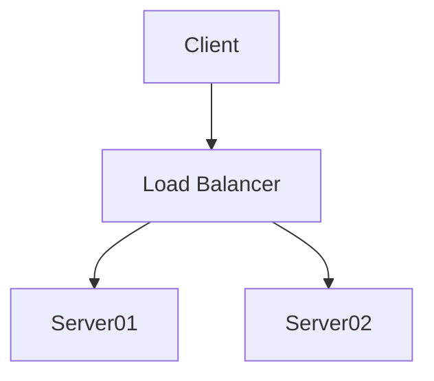

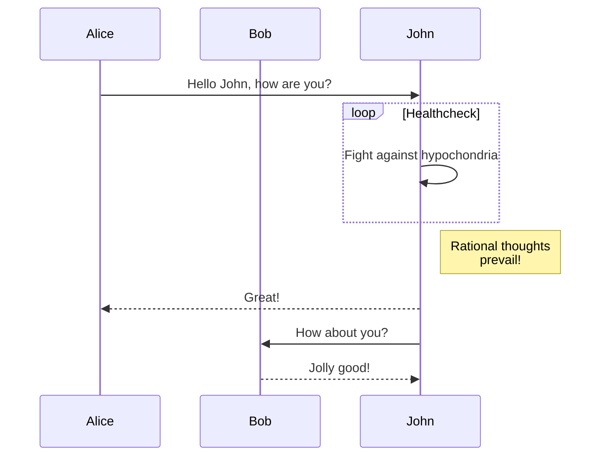

## Gantt

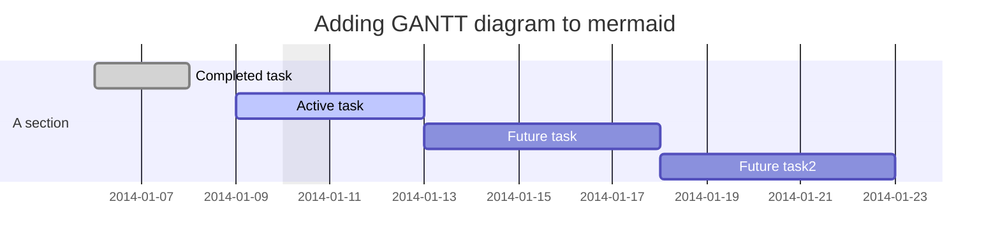

## Class Diagram

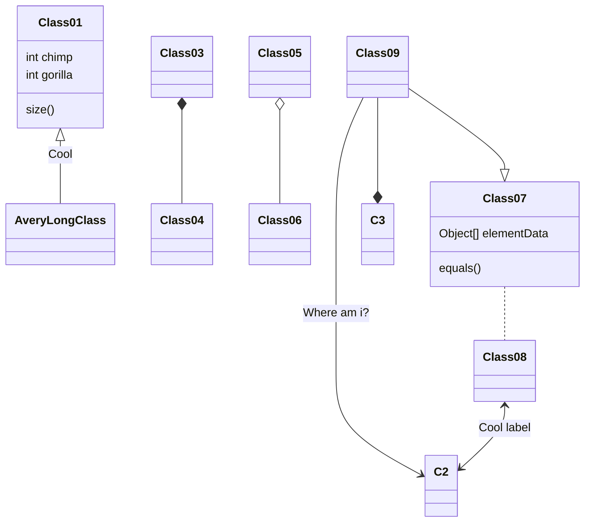

## Top-down

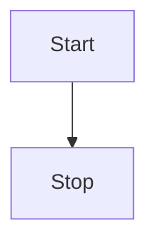

## Left-right

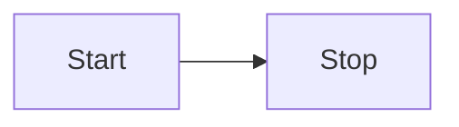

## Node types

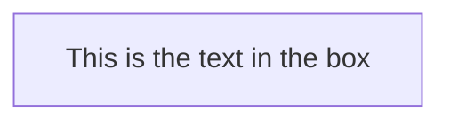

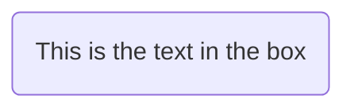

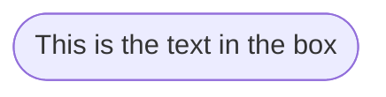

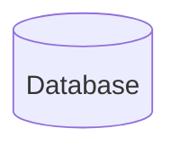

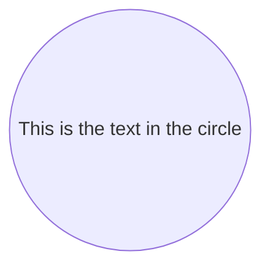


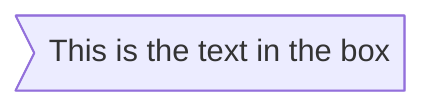

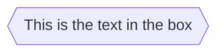


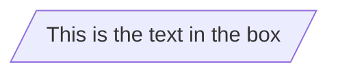

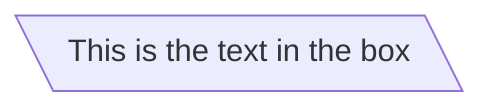

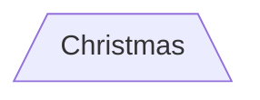

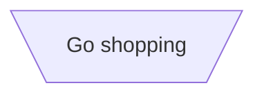

## Arrows and labels

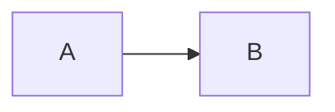

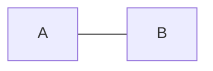

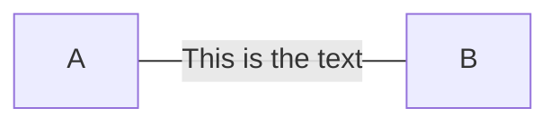

```mermaid
graph LR
    A---|This is the text|B
```

```mermaid
graph LR
    A-->|text|B
```

```mermaid
graph LR
    A-- text -->B
```

```mermaid
graph LR;
   A-.->B;
```

```mermaid
graph LR
   A-. text .-> B
```

```mermaid
graph LR
   A ==> B
```

```mermaid
graph LR
   A == text ==> B
```

```mermaid
graph LR
   A -- text --> B -- text2 --> C
```

```mermaid
graph LR
   a --> b & c--> d
```

```mermaid
graph TB
    A & B--> C & D
```

```mermaid
graph TB
    A --> C
    A --> D
    B --> C
    B --> D
```

```mermaid
graph LR
    id1["This is the (text) in the box"]
```

```mermaid
graph LR
        A["A double quote:#quot;"] -->B["A dec char:#9829;"]
```

## Subgraphs

```mermaid
graph TB
    c1-->a2
    subgraph one
    a1-->a2
    end
    subgraph two
    b1-->b2
    end
    subgraph three
    c1-->c2
    end
```

## Formating nodes

```mermaid
graph LR;
    A-->B;
    click A callback "Tooltip for a callback"
    click B "http://www.github.com" "This is a tooltip for a link"
```

```mermaid
graph LR
    id1(Start)-->id2(Stop)
    style id1 fill:#f9f,stroke:#333,stroke-width:4px
    style id2 fill:#bbf,stroke:#f66,stroke-width:5px,color:red,stroke-dasharray: 5, 5
```

```mermaid
graph LR
    A:::someclass --> B
    classDef someclass fill:#f96;
```

```mermaid
graph LR;
    A-->B[AAA<span>BBB</span>];
    B-->D;
    class A cssClass;
```

## Special characters

```mermaid
graph TD
    B["fa:fa-twitter for peace"]
    B-->C[fa:fa-ban forbidden]
    B-->D(fa:fa-spinner);
    B-->E(A fa:fa-camera-retro perhaps?);
```

```mermaid
graph LR
    A[Hard edge] -->|Link text| B(Round edge)
    B --> C{Decision}
    C -->|One| D[Result one]
    C -->|Two| E[Result two]
```

## Sequence Diagram

```mermaid
sequenceDiagram
    participant John
    participant Alice
    Alice->>John: Hello John, how are you?
    John-->>Alice: Great!
```

```mermaid
sequenceDiagram
    participant A as Alice
    participant J as John
    A->>J: Hello John, how are you?
    J->>A: Great!
```

```mermaid
sequenceDiagram
    Alice->>John: Hello John, how are you?
    activate John
    John-->>Alice: Great!
    deactivate John
```

```mermaid
sequenceDiagram
    Alice->>+John: Hello John, how are you?
    John-->>-Alice: Great!
```

```mermaid
sequenceDiagram
    Alice->>+John: Hello John, how are you?
    Alice->>+John: John, can you hear me?
    John-->>-Alice: Hi Alice, I can hear you!
    John-->>-Alice: I feel great!
```

```mermaid
sequenceDiagram
    participant John
    Note right of John: Text in note
```

```mermaid
sequenceDiagram
    Alice->John: Hello John, how are you?
    Note over Alice,John: A typical interaction
```

```mermaid
sequenceDiagram
    Alice->John: Hello John, how are you?
    loop Every minute
        John-->Alice: Great!
    end
```

```mermaid
sequenceDiagram
    Alice->>Bob: Hello Bob, how are you?
    alt is sick
        Bob->>Alice: Not so good :(
    else is well
        Bob->>Alice: Feeling fresh like a daisy
    end
    opt Extra response
        Bob->>Alice: Thanks for asking
    end
```

https://mermaid-js.github.io/mermaid/#/sequenceDiagram?id=background-highlighting

https://mermaid-js.github.io/mermaid/#/sequenceDiagram?id=parallel

%% this is a comment

## Class Diagrams

```mermaid
classDiagram
     Animal <|-- Duck
     Animal <|-- Fish
     Animal <|-- Zebra
     Animal : +int age
     Animal : +String gender
     Animal: +isMammal()
     Animal: +mate()
     class Duck{
         +String beakColor
         +swim()
         +quack()
     }
     class Fish{
         -int sizeInFeet
         -canEat()
     }
     class Zebra{
         +bool is_wild
         +run()
     }
```

```mermaid
classDiagram
    class BankAccount
    BankAccount : +String owner
    BankAccount : +Bigdecimal balance
    BankAccount : +deposit(amount)
    BankAccount : +withdrawl(amount)
```

```mermaid
classDiagram
    class Animal
    Vehicle <|-- Car
```

```mermaid
classDiagram
  class BankAccount{
    +String owner
    +BigDecimal balance
    +deposit(amount) bool
    +withdrawl(amount)
  }
```

```mermaid
classDiagram
  class BankAccount{
      +String owner
      +BigDecimal balance
      +deposit(amount) bool
      +withdrawl(amount) int
  }
```

```mermaid
classDiagram
  class Square~Shape~{
      int id
      List~int~ position
      setPoints(List~int~ points)
      getPoints() List~int~
  }

  Square : -List~string~ messages
  Square : +setMessages(List~string~ messages)
  Square : +getMessages() List~string~
```

Type 	Description
<|-- 	Inheritance
*-- 	Composition
o-- 	Aggregation
--> 	Association
-- 	Link (Solid)
..> 	Dependency
..|> 	Realization
.. 	Link (Dashed)


```mermaid
classDiagram
classA <|-- classB
classC *-- classD
classE o-- classF
classG <-- classH
classI -- classJ
classK <.. classL
classM <|.. classN
classO .. classP

```

```mermaid
classDiagram
classA --|> classB : Inheritance
classC --* classD : Composition
classE --o classF : Aggregation
classG --> classH : Association
classI -- classJ : Link(Solid)
classK ..> classL : Dependency
classM ..|> classN : Realization
classO .. classP : Link(Dashed)
```

```mermaid
classDiagram
classA <|-- classB : implements
classC *-- classD : composition
classE o-- classF : association
```

* 0..1 Zero or one
* 1 Only 1
* 0..1 Zero or One
* 1..* One or more
* \* Many
* n n {where n>1}
* 0..n zeor to n {where n>1}
* 1..n one to n {where n>1}


```mermaid
classDiagram
    Customer "1" --> "*" Ticket
    Student "1" --> "1..*" Course
    Galaxy --> "many" Star : Contains
```

## State Diagram

```mermaid
stateDiagram
    [*] --> Still
    Still --> [*]

    Still --> Moving
    Moving --> Still
    Moving --> Crash
    Crash --> [*]
```

```mermaid
stateDiagram
    s1
```

```mermaid
stateDiagram
    state "This is a state description" as s2
```

```mermaid
stateDiagram
    s2 : This is a state description
```

```mermaid
stateDiagram
    s1 --> s2
```

```mermaid
stateDiagram
    s1 --> s2: A transition
```

```mermaid
stateDiagram
    [*] --> s1
    s1 --> [*]
```

```mermaid
stateDiagram
    [*] --> First
    state First {
        [*] --> second
        second --> [*]
    }
```

```mermaid
stateDiagram
    [*] --> First

    state First {
        [*] --> Second

        state Second {
            [*] --> second
            second --> Third

            state Third {
                [*] --> third
                third --> [*]
            }
        }
    }
```

```mermaid
stateDiagram
    [*] --> First
    First --> Second
    First --> Third

    state First {
        [*] --> fir
        fir --> [*]
    }
    state Second {
        [*] --> sec
        sec --> [*]
    }
    state Third {
        [*] --> thi
        thi --> [*]
    }
```

```mermaid
stateDiagram
 state fork_state <<fork>>
   [*] --> fork_state
   fork_state --> State2
   fork_state --> State3

   state join_state <<join>>
   State2 --> join_state
   State3 --> join_state
   join_state --> State4
   State4 --> [*]
```

```mermaid
stateDiagram
    State1: The state with a note
    note right of State1
        Important information! You can write
        notes.
    end note
    State1 --> State2
    note left of State2 : This is the note to the left.
```

```mermaid
stateDiagram
    [*] --> Active

    state Active {
        [*] --> NumLockOff
        NumLockOff --> NumLockOn : EvNumLockPressed
        NumLockOn --> NumLockOff : EvNumLockPressed
        --
        [*] --> CapsLockOff
        CapsLockOff --> CapsLockOn : EvCapsLockPressed
        CapsLockOn --> CapsLockOff : EvCapsLockPressed
        --
        [*] --> ScrollLockOff
        ScrollLockOff --> ScrollLockOn : EvCapsLockPressed
        ScrollLockOn --> ScrollLockOff : EvCapsLockPressed
    }
```
