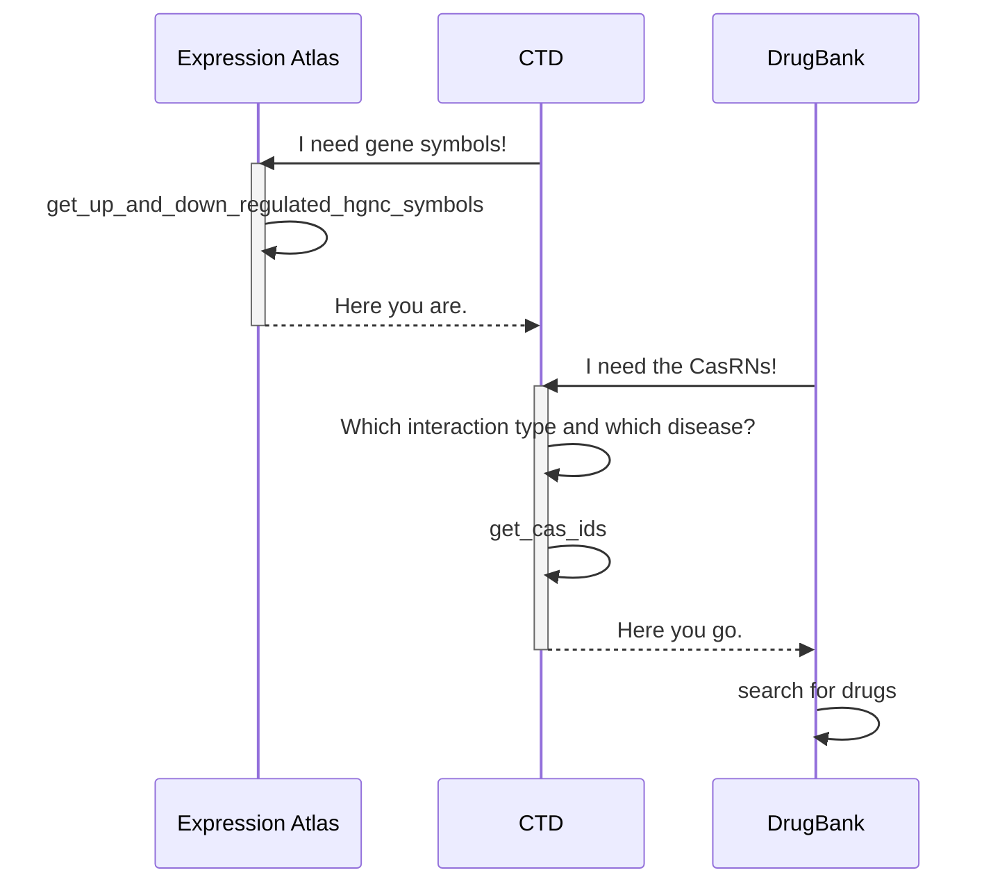
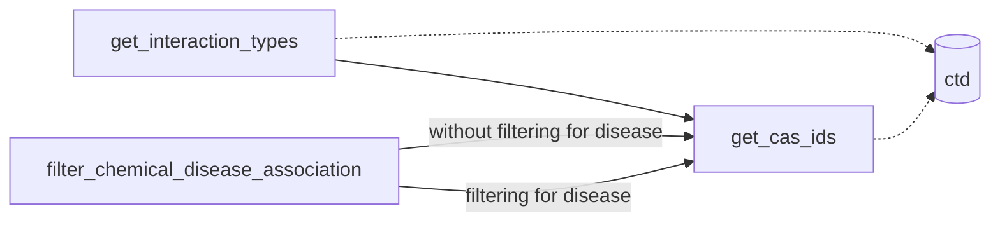

```mermaid
sequenceDiagram
    participant e as Expression Atlas
    participant c as CTD
    participant d as DrugBank
    c ->> e: I need gene symbols!
    activate e
    e ->> e: get_up_and_down_regulated_hgnc_symbols
    e -->> c: Here you are.
    deactivate e
    d ->> c: I need the CasRNs!
    activate c
    c ->> c: Which interaction type and which disease?
    c ->> c: get_cas_ids
    c -->> d: Here you go.
    deactivate c
    d ->> d: search for drugs
```

```mermaid
graph LR
  A[get_interaction_types]
  A[get_interaction_types] -.-> id1[(ctd)] 
  A[get_interaction_types] --> C[get_cas_id]
  C[get_cas_ids] -.-> id1[(ctd)] 
  B[filter_chemical_disease_association] -->|without filtering for disease| C[get_cas_ids]
  B[filter_chemical_disease_association] -->|filtering for disease| C[get_cas_ids]

```
